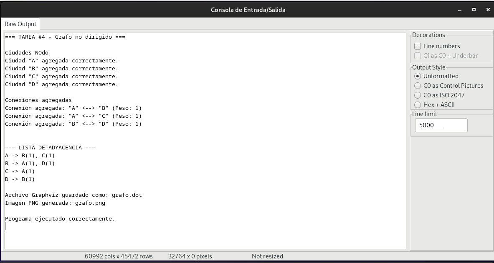
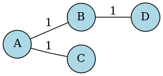

# T4 - 201801392
El programa se hizo de forma quemada en consola, por lo que al ejecutarlo se verá en la carpeta de la tarea el .dot y el .png del grafo.

## Capturas 

### Captura 1

### Captura 2

